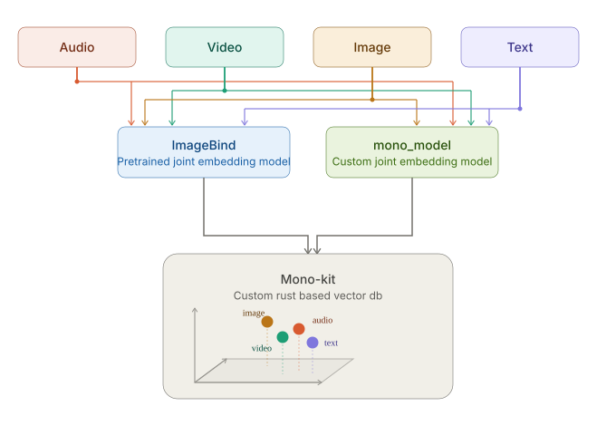

# Mono-Kit

Mono-Kit is a library for multimodal embeddings and vector retrieval. It provides embedding models that project text, images, audio, and video into a shared embedding space, together with a custom vector database for indexing and similarity search over those embeddings.



The project currently includes:

- `mono_model`, a trainable multimodal embedding model.
- [`ImageBind`](https://github.com/facebookresearch/ImageBind.git) integration.
- A vector database implemented in Rust with Python bindings via PyO3.

## Note

### M1 (Legacy)

The first iteration of Mono-Kit, built using VGGish (audio), MobileNet (image), MXBAI (text embeddings), Chroma, and a custom user-trainable Siamese similarity model. It provides multimodal functionality, but the embeddings do not share a common latent space and lack true cross-modal understanding. By today's standards, M1 is obsolete.

#### Install M1

```bash
pip install mono-kit
```

- **PyPI:** https://pypi.org/project/mono-kit

### M2 (Recommended)

A significantly more powerful and capable compare of M1.

#### Install M2

```bash
git clone https://github.com/RijoSLal/mono-kit.git
rm -rf M1
cd M2
pip install .
```
or 

```bash
# PyPI link is currently unavailable due to an account recovery delay. It will be updated shortly
```

- **Documentation:** https://github.com/RijoSLal/mono-kit/blob/main/M2/README.md

## Retrieval Capabilities

```text
Text  ↔ Text, Image, Audio, Video
Image ↔ Image, Text, Audio, Video
Audio ↔ Audio, Text, Image, Video
Video ↔ Video, Text, Image, Audio
```

## Features

- Shared embedding space for text, image, audio, and video.
- Cross-modal and same-modal retrieval.
- Custom vector database implemented in Rust.
- Python bindings via PyO3.
- Trainable multimodal embedding model (`mono_model`).

## `mono_model` Architecture

| Modality | Encoder |
|----------|----------|
| Image | EfficientNet-B0 |
| Audio | Log-Mel Spectrogram + RoPE-based encoder |
| Video | LRCN-inspired architecture with Attention layers |
| Text | LLM-style RoPE-based encoder |

## Training

```bash
M2/monokit.ipynb
```

> ! WARNING....
> The released `mono_model` weights were trained on approximately **15,000 samples** due to hardware constraints and should be considered experimental.
>
> For reference, `mono_model` has approximately **145M parameters**. Following the Chinchilla scaling law (`~20 tokens per parameter`), a compute-optimal training run would require roughly:
>
> `145M × 20 ≈ 2.9B` training tokens (or token-equivalent multimodal samples),
>
> which is several orders of magnitude larger than the released checkpoint and would typically involve training over multiple epochs.

## Testing

```bash
python test.py
```

## License

Licensed under the MIT License. See [LICENSE](LICENSE).